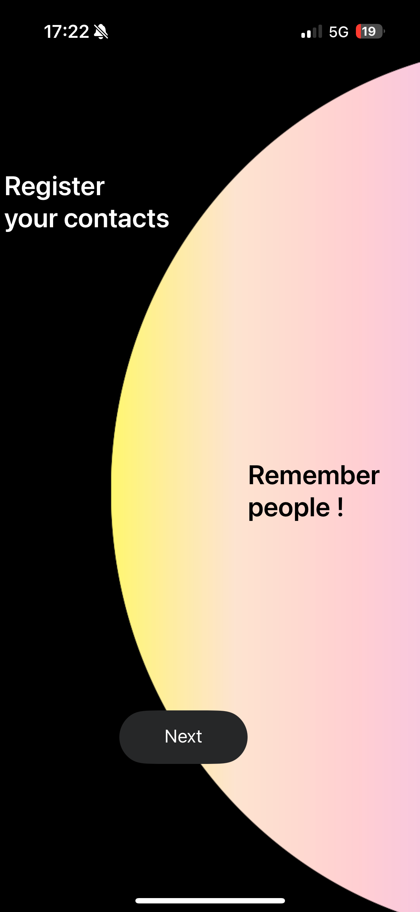
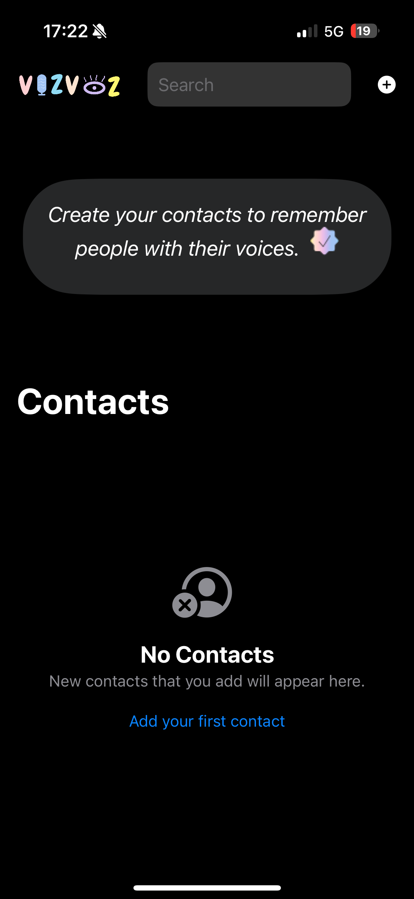
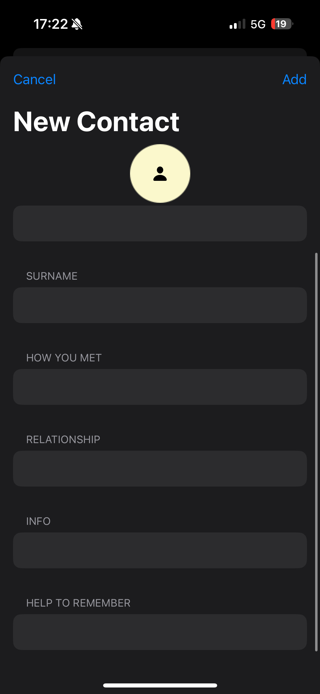
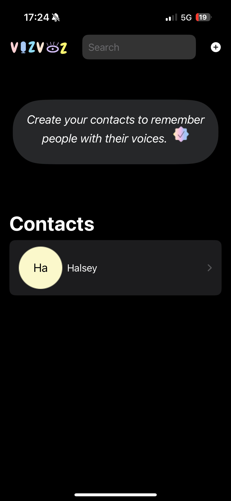
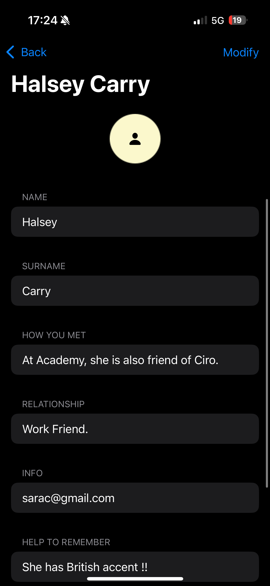
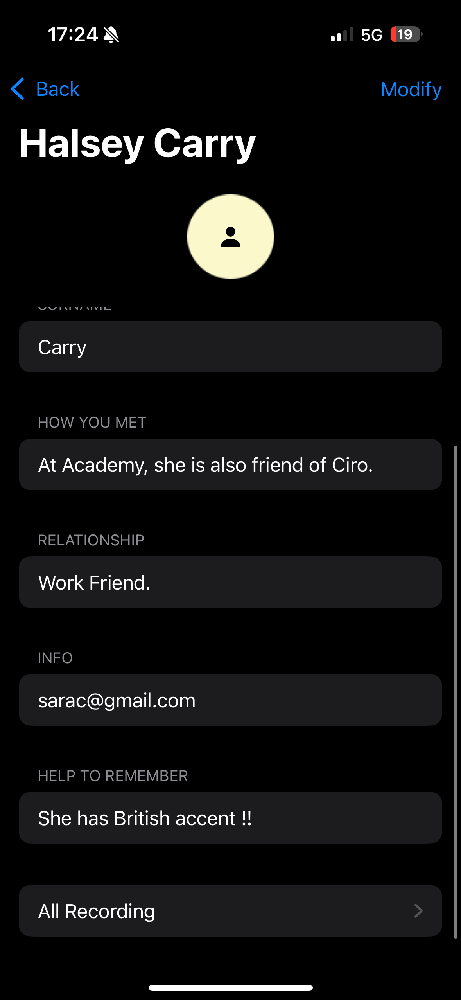
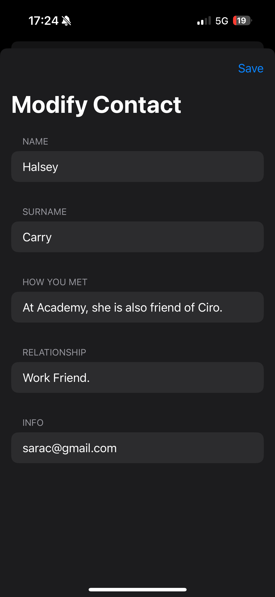
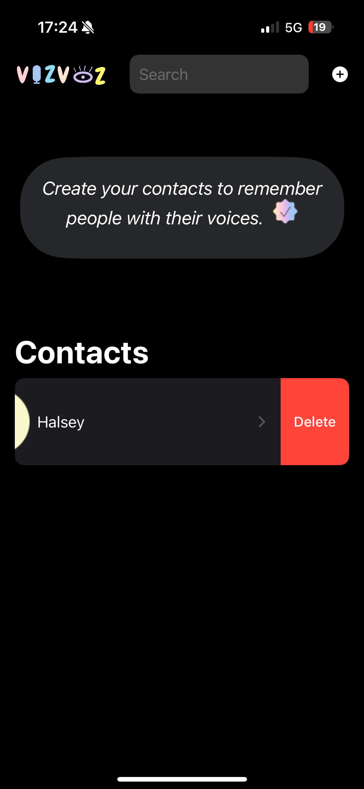
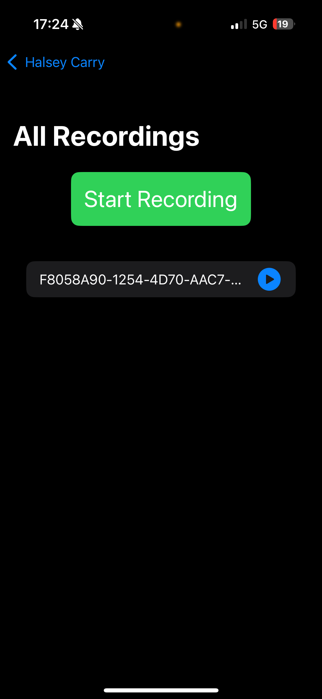

# Vizvoz-People Reminder  👭🏻

This is a simple iOS app built with Xcode that helps users help to remember people that they met by registering their information and recording their voice or adding voice records for each contact  to remember them.

## Features
- Add, edit, and delete tasks ✍🏻
- Creat new contacts 📝
- Registering information about people 🙋🏻‍♀️
- Voice record feature for remembering people 🎵
- Voice over support 🫂
  

## Installation
1. Clone this repository: `git clone <https://github.com/iremarslnr/VizvozApp-TEST.git>
2. Open the project in Xcode.
3. Run the app on a simulator or connected device.

## Credits
- Special thanks to me.

